---
## Front matter
lang: ru-RU
title: Лабораторная работа
subtitle: Номер 1
author:
  - Андрюшин Н. С. 
institute:
  - Российский университет дружбы народов, Москва, Россия
date: 01 января 1970

## i18n babel
babel-lang: russian
babel-otherlangs: english

## Formatting pdf
toc: false
toc-title: Содержание
slide_level: 2
aspectratio: 169
section-titles: true
theme: metropolis
header-includes:
 - \metroset{progressbar=frametitle,sectionpage=progressbar,numbering=fraction}
 
## Fonts
mainfont: IBM Plex Serif
romanfont: IBM Plex Serif
sansfont: IBM Plex Sans
monofont: IBM Plex Mono
mathfont: STIX Two Math
mainfontoptions: Ligatures=Common,Ligatures=TeX,Scale=0.94
romanfontoptions: Ligatures=Common,Ligatures=TeX,Scale=0.94
sansfontoptions: Ligatures=Common,Ligatures=TeX,Scale=MatchLowercase,Scale=0.94
monofontoptions: Scale=MatchLowercase,Scale=0.94,FakeStretch=0.9
mathfontoptions:
---

# Информация

## Докладчик

:::::::::::::: {.columns align=center}
::: {.column width="70%"}

  * Андрюшин Никита Сергеевич
  * Студент
  * Российский университет дружбы народов

:::
::: {.column width="30%"}

:::
::::::::::::::

## Цель работы

Установить Linux Rocky и ознакомиться с его возможностями

## Задание

Установить ОС и выдолнить домешнее задание

## Выбор диска

Для начала назовём нашу виртуалку и выберем установочный диск

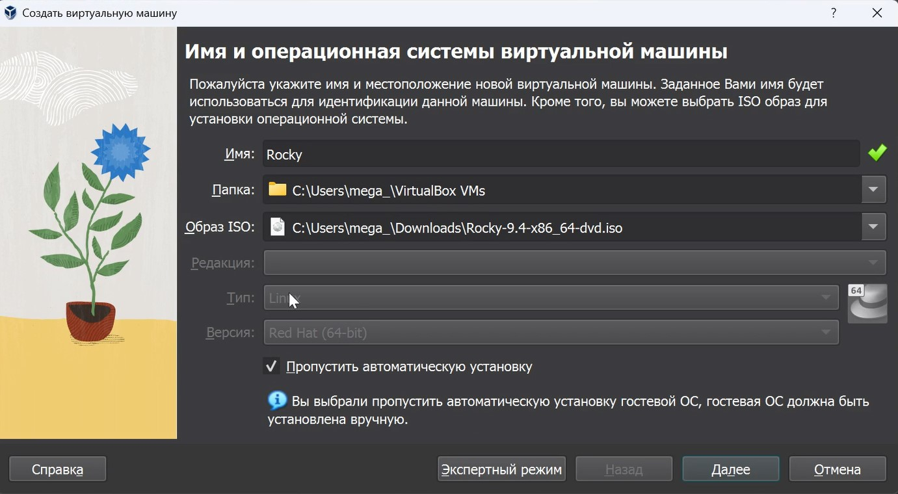{width=45%}

## Выделение памяти и процессора

Выделим память и процессор 

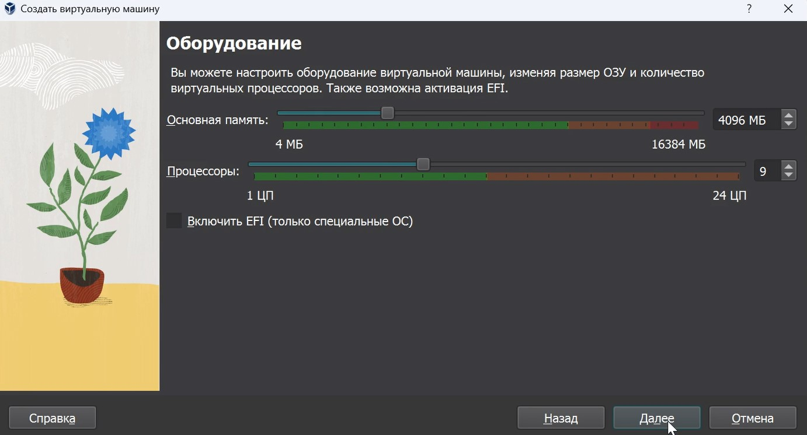{width=45%}

## Выделение диска

Выделим размер диска. Будет 30 гб 

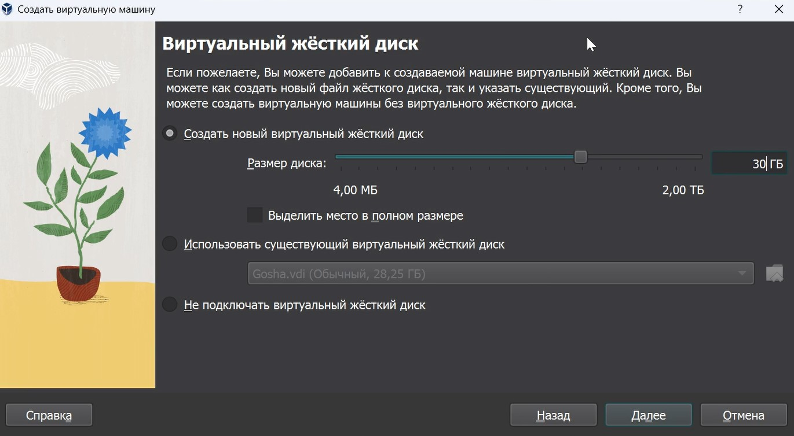{width=45%}

## выбор языка

Здесь мы выберем русский язык ]

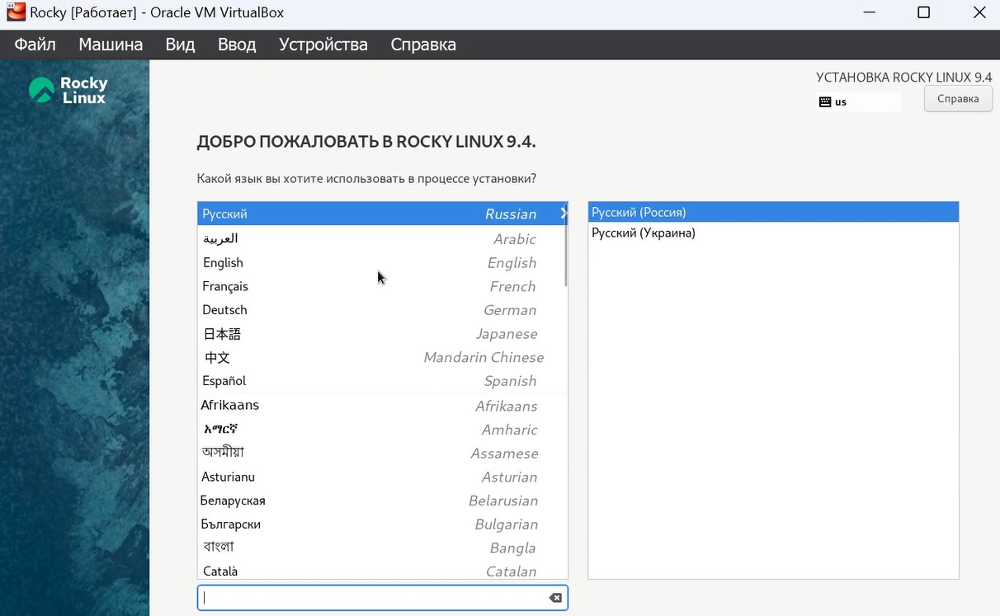{width=45%}

## 

Выберем диск, куда установится система 

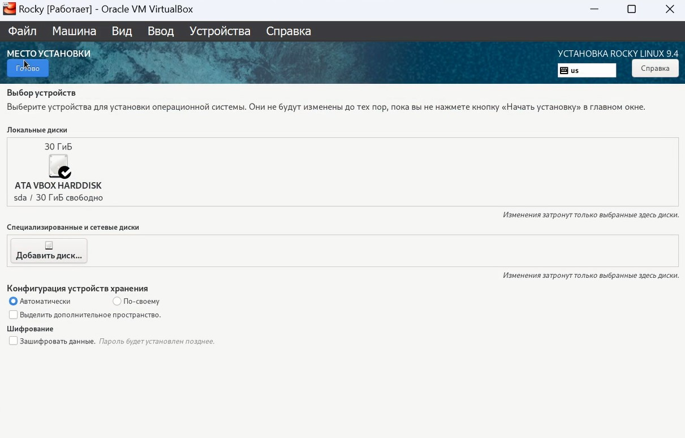{width=45%}

## Отключение kdump

Отключим kdump

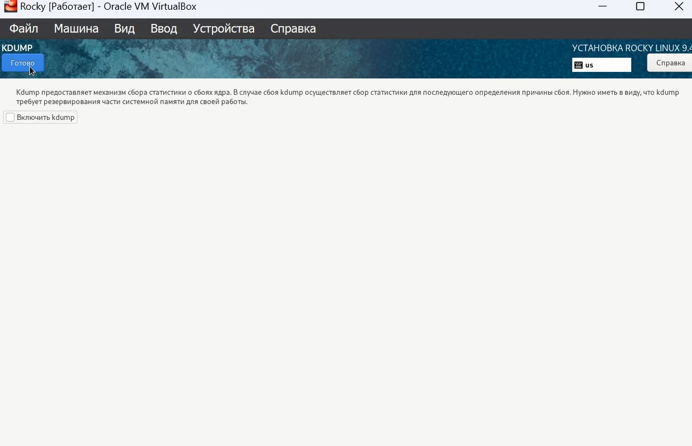{width=45%}

## Настройка сети

Настроим сеть. В качестве имени узла выберем nsandryushin.localdomain 

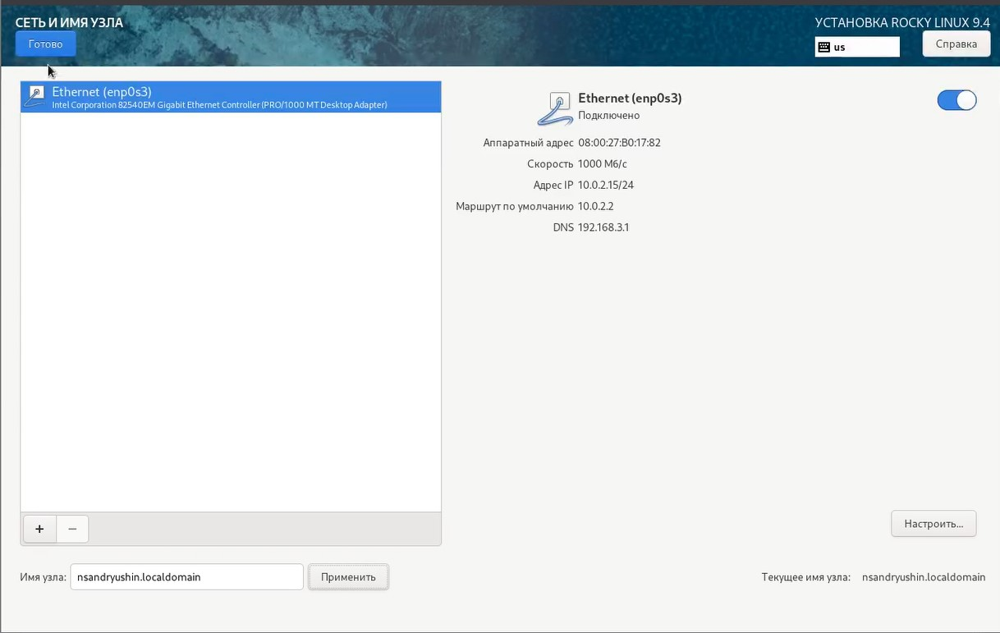{width=45%}

## Название рисунка

Настроим рут пользователя, указав пароль для него и разрешив ему ssh 

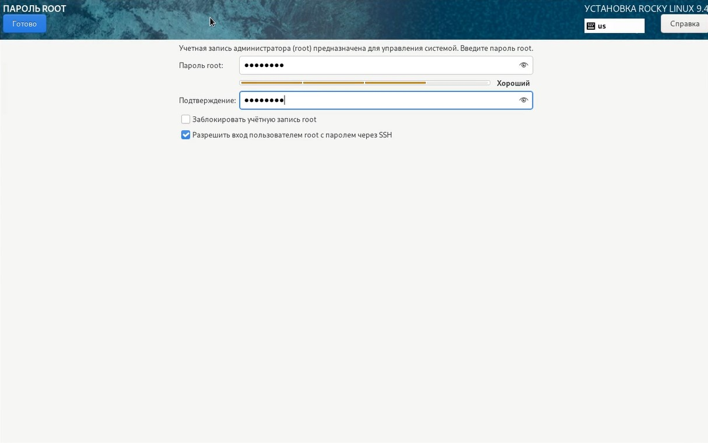{width=45%}

## Настройка пользователя

Настроим своего пользователя согласно соглашению об именовании

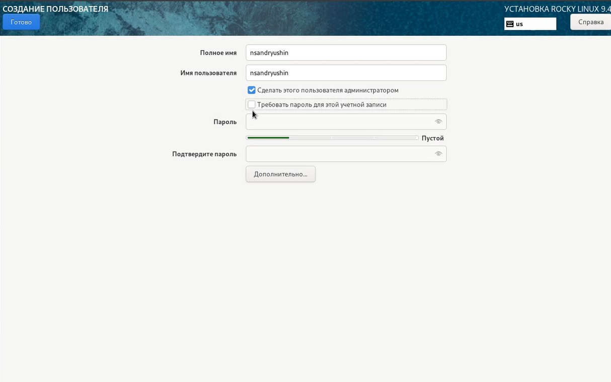{width=45%}

## Экран окончания установки

Ждём завершения установки. По завершении видем следующее и перезагружаемся 

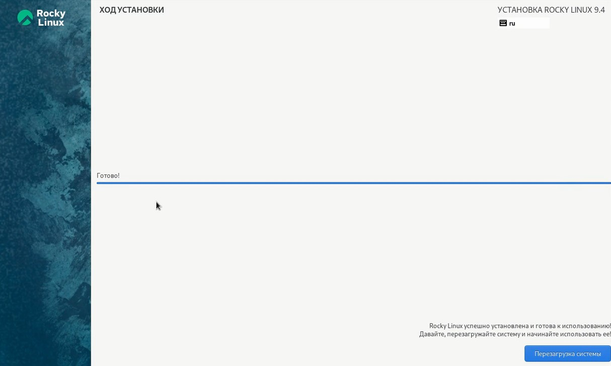{width=45%}

## Установка дополнений

После перезугрузки установим дополнения гостевой ОС 

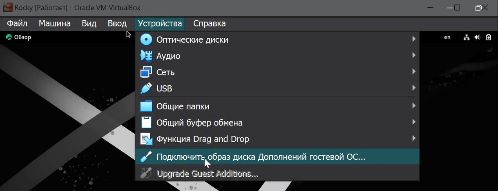{width=45%}

## Завершение установки

Вот как выглядит завершение установки 

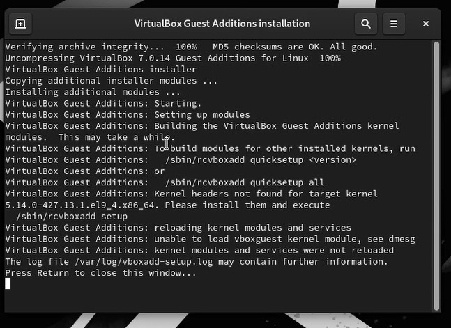{width=45%}

## Версия ядра

Теперь выполним домашнее задание. Найдём версию ядра 

{width=45%}

## Частота процессора

И частоту процессора 

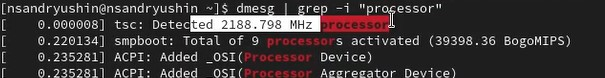{width=45%}

## Модель процессора

И модель процессора 

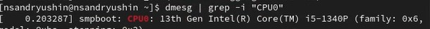{width=45%}

## Доступная память

И количество доступной памяти 

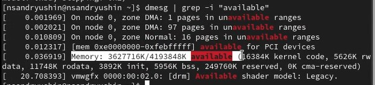{width=45%}

## Гипервизор

И гепирвизор 

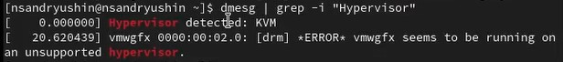{width=45%}

## Порядок монтирования

И порядок монтирования файловых систем вместе с их типами. Тип файловой системы, вероятно, xfs 5 версии 

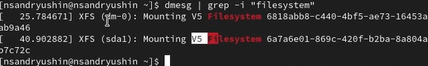{width=45%}

## Выводы

в результате выполнения работы была установлена система
